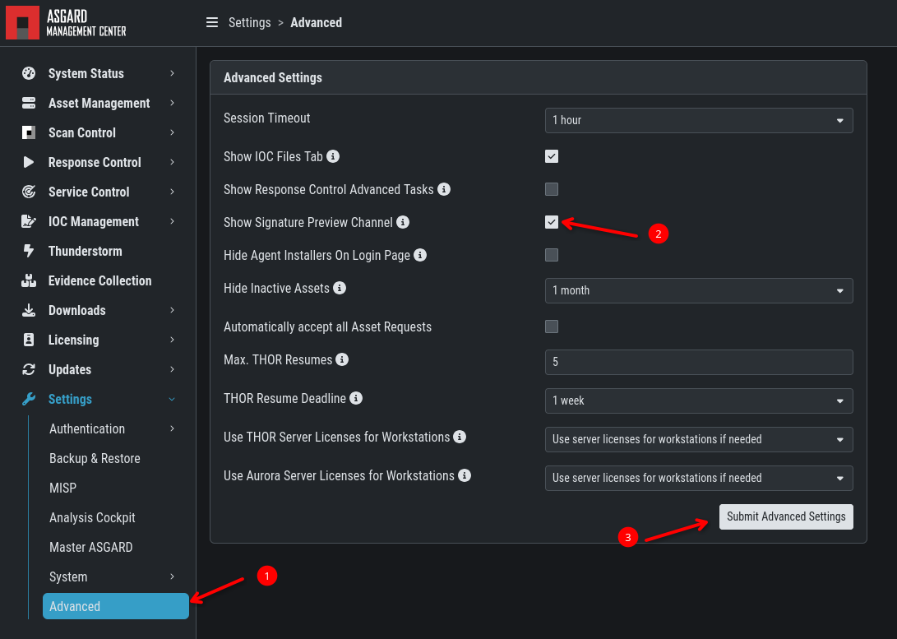
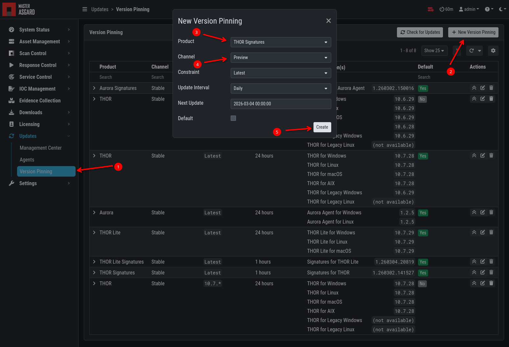

.. index:: Advanced Settings

Advanced Settings
=================

The Advanced tab lets you specify additional global settings.
The session timeout for web-based UI can be configured. Default
is one hour. If ``Show Advanced Tasks`` is set, ASGARD will
show system maintenance jobs (e.g. update ASGARD Agent on endpoints)
within the response control section. 

Inactive assets can be hidden in the Asset Management Section
by setting a suitable threshold for ``Hide inactive Assets``. 

.. figure:: ../images/mc_advanced-settings.png
   :alt: Advanced Settings

   Advanced Settings

Preview Signatures
------------------

We offer a "preview" (formerly known as ``SigDev``) of our newest
signatures, which contains our newest rules. Those signatures have
been processed by our automated pipeline and passed the quality
check - however our manual testing of those new rules did not take place yet.

We have those signatures to offer the newest rules to our customers in time
critical engagements. You have to carefully consider if the potential higher
rate of false positive warrants the usage of those rules. We generally recommend
to only use those rules if the currently available signatures are a few days old.

To enable the ``Preview`` Channel for THOR Signatures in the ``Version Pinning``
section, simply activate the checkbox ``Show Signature Preview Channel`` and
submit your changes.

   Preview Signatures

Once you enabled the option, you can create a version constraint in the
Version Pinning section:

   Preview Signatures Scanning