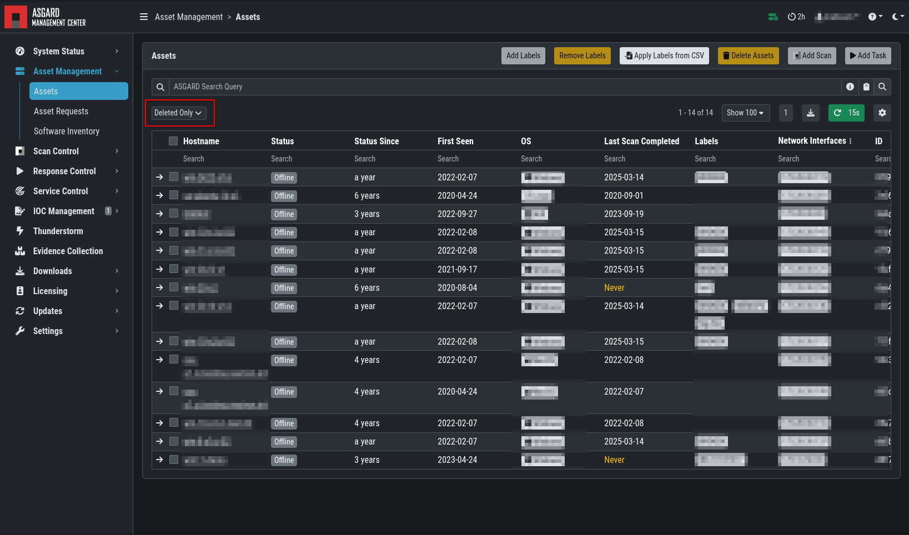

.. index:: Asset Management

Asset Management
================

The ``Assets`` view shows all connected ASGARD Agents. New assets are
listed under ``Asset Requests`` and require manual approval before they
can connect to ASGARD. For automatic acceptance, see
:ref:`administration/advanced:advanced settings`.

If the ``Duplicate Assets`` view is visible, remediate the issue promptly
to avoid unwanted side effects on duplicate hosts.

.. warning::
   Assets in the ``Duplicate Assets`` view indicate that one or more
   agents are running on multiple endpoints. This might be caused by
   cloning a system with an already installed ASGARD Agent. Undesirable
   side effects of duplicate assets are alternating hostnames and tasks
   that fail immediately.

For remediation, see :ref:`troubleshooting/agent-debugging:duplicate assets remediation`.

Asset Overview
^^^^^^^^^^^^^^

Use Asset Management to manage all endpoints registered with ASGARD. Assets
are shown in a table with their individual ASGARD ID, IP addresses, and
hostnames.

.. figure:: ../images/mc_assets-view.png
   :alt: Asset View

   Asset View

By clicking the control buttons in the Actions column, you can start
a new scan, run a response playbook, open a command line, or browse the
remote file system.

.. note::

    * Depending on the user's role, some of the control buttons may be disabled
    * The ``Run Scan`` button might be greyed out in new installations because
      ASGARD Management Center has not downloaded the THOR packages yet.
      You can either wait for a few minutes, or see the chapter
      :ref:`administration/updates:version pinning`,
      to trigger a download manually.

Asset Labels
^^^^^^^^^^^^

Labels are used to group assets. These groups can then be used in scans or tasks.

You can add multiple labels to an asset or a group of assets. Select the
assets in the left column, enter the label name (for example, New_Label),
and click the blue ``Add Labels`` button.

.. note::
   Do not use labels with whitespace characters. They can cause issues with
   Analysis Cockpit synchronization, exports, imports, or other underlying
   legacy functions.

.. figure:: ../images/mc_add-labels.png
   :alt: Asset Labeling

   Add labels

To remove labels, select your assets, click the yellow ``Remove Labels``
button, and enter the name of the label you want to remove from these assets.

.. figure:: ../images/mc_remove-labels.png
   :alt: Asset Labeling

   Remove labels

The asset management section has extensive filtering capabilities. For
example, you can select only Linux endpoints that have been online today
and have a specific label assigned.

Export Asset List 
~~~~~~~~~~~~~~~~~

The Import/Export section allows you to export your assets to a CSV file.

Import Labels
~~~~~~~~~~~~~

The import function allows you to add or remove labels on assets based on
columns in the previously generated CSV file.

The import function processes the values in the columns ``Add Labels ...`` and ``Remove Labels ...``
only. To change labels, use the exported list, add values in these columns,
and re-import it by using the ``Apply Labels from CSV`` button. Separate
multiple labels with commas. Leading and trailing whitespace characters are
stripped from the labels.

.. figure:: ../images/asset-label-import.png
   :alt: Asset Labeling via CSV

   Asset Labeling via CSV

ASGARD Search Query
^^^^^^^^^^^^^^^^^^^

You can search for assets in your Management Center with the ``ASGARD Search Query``.
This allows you to write more complex queries for assets. It also gives you
more flexibility for scan and response tasks because you can specify a query
instead of assigning labels to all assets first. For example, you might want
to scan a specific subnet every week, including new agents deployed in that
subnet. The following query would achieve this:

``system = "linux" and interfaces = "172.16.50.0/24"``

This would run the task on all Linux systems in the subnet 172.16.50.0/24.

The following operators are available:

.. csv-table::
     :file: ../csv/asgard-query-operators.csv
     :widths: 30, 70
     :delim: ;
     :header-rows: 1

You can create simple or complex queries this way. Use brackets to group
queries:

``(system = "linux" and interfaces = "172.28.30.0/24") or (system = "windows" and interfaces = "172.28.50.0/24")``

``(system = "linux" and interfaces = "172.28.30.0/24" and labels = "my-label") or labels = "robot-test"``

The following keys for the asset query are available:

.. csv-table::
     :file: ../csv/asgard-query-fields.csv
     :widths: 50, 50
     :delim: ;
     :header-rows: 1

.. hint:: 
   You can see which query name a field has by enabling the column in your asset view
   and clicking into the query text field:

   .. figure:: ../images/asgard_asset_query_fieldnames.png

The ASGARD Search Query is the preferred tool to manage scans and assets.
If you are using Analysis Cockpit and need labels, you can still use them.

Asset Migration
^^^^^^^^^^^^^^^

.. hint::
   You must enable the option ``Show Response Control Advanced Tasks``
   in the ``Settings`` > ``Advanced`` section of your ASGARD Management
   Center to allow Asset Migration.

You can move an asset from one Management Center to another via the Maintenance
module of Response Control. To do this, navigate to ``Assets`` and select the
assets you want to migrate. Alternatively, navigate to ``Response Control`` and
add a new task. Click ``Add Task`` to open the task menu. Choose the
``Maintenance`` module and then the ``Move asset to another ASGARD`` type.
Upload an agent installer from the ASGARD system to which you want to migrate
the asset.

.. figure:: ../images/mc_migrate-asset.png
   :alt: Management Center Move Asset

.. note::
   The target OS or architecture of the installer does not matter. Only the
   installer's configuration data is used for the migration.

The task fails if the migrated asset cannot communicate with the new Management
Center. In this case, the asset remains on the Management Center that issued
the migration task. Only the asset is migrated, and it appears as a new asset
on the new Management Center. Scan tasks, response tasks, and logs are not
migrated.

Delete Assets
^^^^^^^^^^^^^

When an asset is deleted, it is **not** permanently removed from the system.
Instead, the asset is **deactivated**.

During deactivation:

- The asset's authentication token is invalidated, preventing it from
  communicating with the ASGARD Management Center.
- The asset is marked as deleted in the backend and no longer appears as an
  active asset.
- Historical data associated with the asset is retained.

Keeping asset records allows the ASGARD Management Center to preserve information
that may be required for auditing, reporting, and investigation purposes, including:

- Playbook execution history
- Remote console sessions
- Other activities and records linked to the asset

This approach ensures that deleting an asset prevents future communication while
preserving historical information for reference and compliance purposes.

.. warning::
   Deleted assets can no longer communicate with the ASGARD Management Center.
   Use this action with caution. Ensure the agent is also removed from the endpoint,
   otherwise it will automatically re-register itself as a new asset within 10–15 minutes.

   Deleted Assets View
