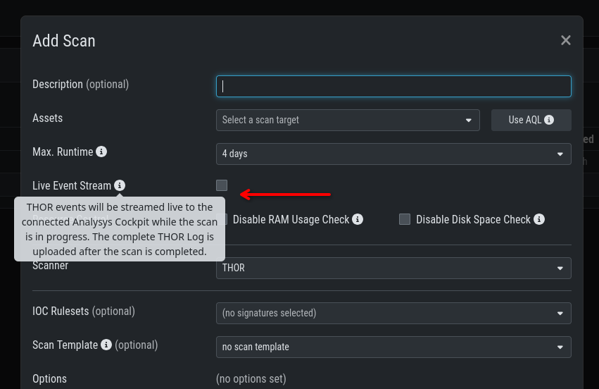

.. index:: Scan Control

Scan Control
------------

Scan Control in your Management Center allows you to run different kinds of
scans on one or multiple assets. You can also create ``Scan Templates`` for
new scans, so default options do not need to be configured for every scan.
``Scan Templates`` can also restrict which users are allowed to execute new
scans with them. ``False-Positive Filters`` can exclude specific files or
entire directories from scan results.

Your Management Center also handles stopped THOR scans, for example if an
asset reboots or loses connection during a scan. A scan will not fail solely
because the asset is temporarily offline.

.. warning::
   When creating a scan job, the Management Center offers almost all possible scan
   options that can be used with THOR. Use these options carefully because some
   options may lead to incompatibilities, failed scans, or errors.
 
- Example 1: A combination of ``--truncate 0`` and ``--allreasons`` may lead to
  very long THOR event log lines (> 64 KB), which `cannot be processed by the Analysis
  Cockpit properly <https://analysis-cockpit-manual.nextron-systems.com/en/latest/issues/issues.html#aac-002-scan-stuck-at-status-unknown>`_.
 
- Example 2: The use of the ``--processdump`` flag will create files on endpoints
  that are **not** automatically cleaned up.
 
All options can be useful in specific scenarios, but choose them carefully.

Managing Scan Templates
^^^^^^^^^^^^^^^^^^^^^^^

Scan templates are the most convenient way to make use of THOR's rich set of
scan options. You can define scan parameters for THOR 10 and store
them in different templates for later use in single scans and grouped scans.
Scan templates are also useful if you want to automate scanning via the API,
because you only need to specify the template instead of every option. This
also means you can change the template without changing your API request.

For example, you might want to use dedicated scan options for different
system groups, such as Linux servers, domain controllers, or workstations,
and use the same set of scan options every time you scan a group. With your
Management Center, you can add a scan template for each group.

A common use case for scan templates is additional resource control, for
example instructing THOR to set the lowest process priority for itself and
never use more than 50% of CPU.

THOR is already optimized to use the most relevant scan options for a
particular system, based on system type, number of CPUs, and system resources.
Comprehensive resource control is enabled by default.

For more details, see the `THOR manual <https://thor-manual.nextron-systems.com>`_.
Use scan templates when you want to deviate from the default behavior.

Scan templates are protected from being modified by users without the
``Manage Scan Templates`` permission. They can also be restricted from being
used by users if the ``Force Scan Template`` flag is set for the user.
(See section :ref:`administration/users:restrictions` for details).

Click the ``Import Scan Template`` button to import a previously
exported scan template.

.. figure:: ../images/mc_scan-templates.png
   :alt: Scan Templates

   Scan Templates Overview

To create a scan template, navigate to ``Scan Control`` > ``Scan Templates``
and click the ``Add Scan Template`` button. The ``Add Scan Template`` dialog
appears. The current THOR scanner version is selected by default, but you
can change it if needed.

After choosing or changing a scanner, the most frequently used options are
shown at the top of the page in the "Favorite Flags" category. View all THOR
options by clicking the other categories, or search for known flags in the
search bar. Click the star symbols to edit your personal favorites.

.. figure:: ../images/mc_add-scan-template.png
   :alt: Scan Flags

   Scan Flags

By checking the "Default" box, you can make this scan template the default
template for every new scan. There can only be one default template at a
time, and selecting the box clears any previous default.
Checking the "Restricted" flag makes the template restricted. This means only
a limited set of users can use the template for scans. The set of users
consists of all users who do not have the "Force Scan Template" restriction
set. By default, these are all users who are not members of the group
"Operator Level 1".

THOR Excludes and False-Positive Filters
^^^^^^^^^^^^^^^^^^^^^^^^^^^^^^^^^^^^^^^^

In THOR you can define `directory and file excludes <https://thor-manual.nextron-systems.com/en/latest/usage/configuration.html#files-and-directories>`_
and `false positive filters <https://thor-manual.nextron-systems.com/en/latest/usage/configuration.html#false-positives>`_.
These features can be globally defined in ASGARD at ``Scan Control`` > ``THOR Config``.

.. figure:: ../images/mc_thor-config.png
   :alt: Scan Control - Global Directory Exclude and FP Filtering

   Scan Control - Global Directory Exclude and FP Filtering

.. warning::
   Be careful and do not use overly broad filters or excludes. Incorrect
   filters or excludes can reduce THOR's detection capabilities.

Live Event Streaming
^^^^^^^^^^^^^^^^^^^^

Live Event Streaming forwards THOR events to the ASGARD Analysis Cockpit in
real time while a scan is still running, so findings become available for
review without waiting for the scan to finish.

Enable Live Event Streaming with the corresponding checkbox in the scan
settings when creating a single, grouped, or scheduled scan.

   Live Event Streaming
