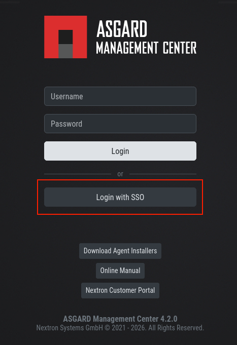
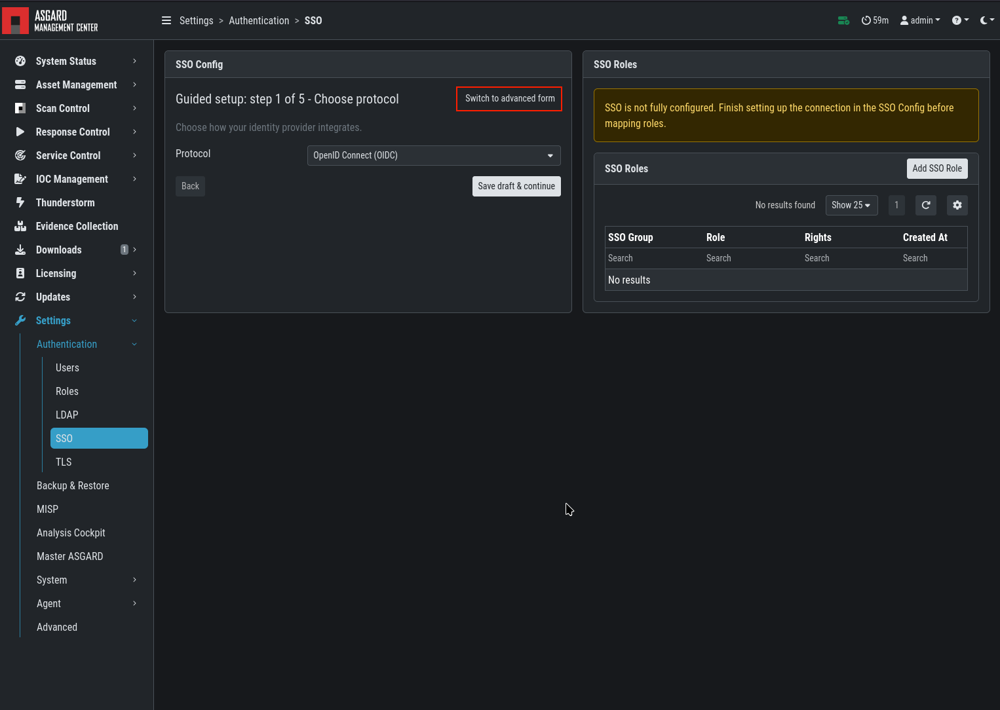
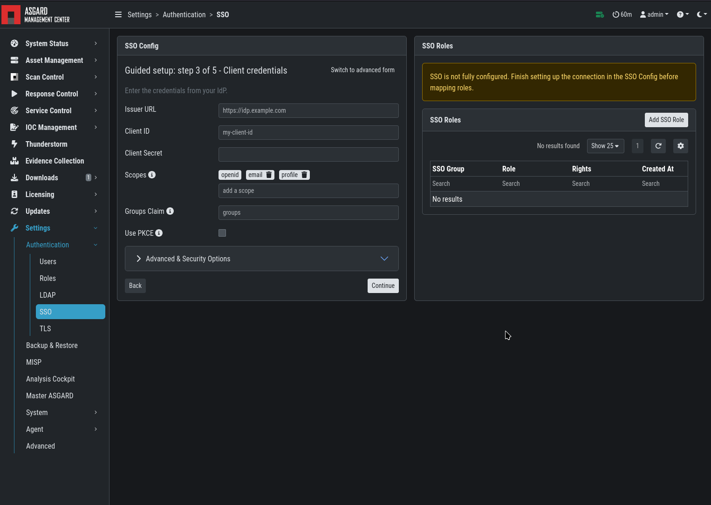
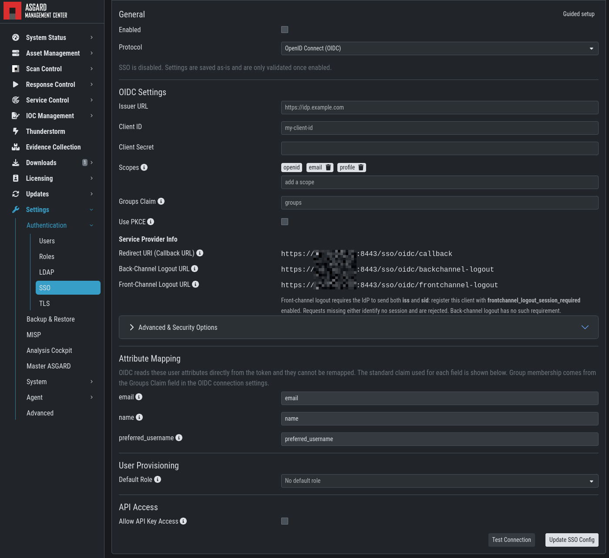
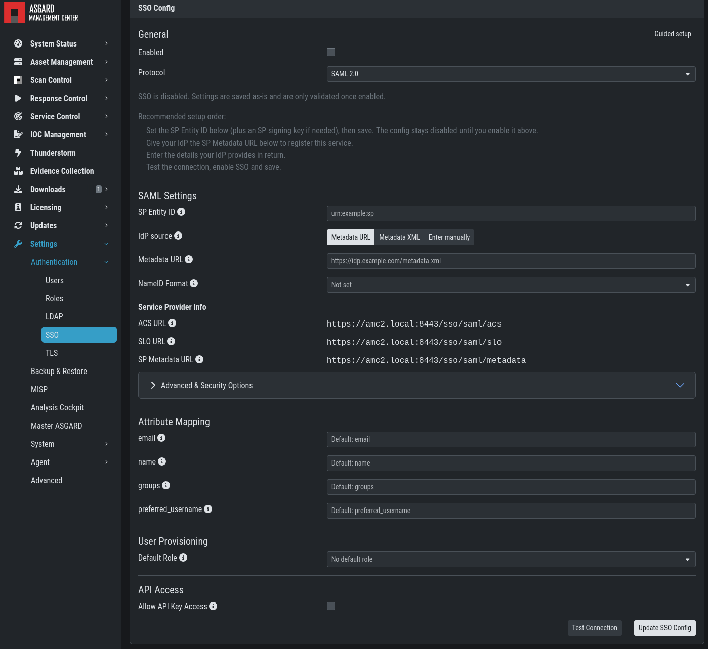
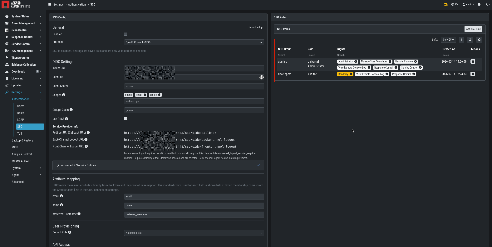
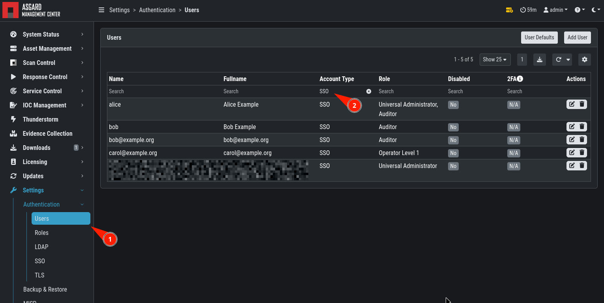
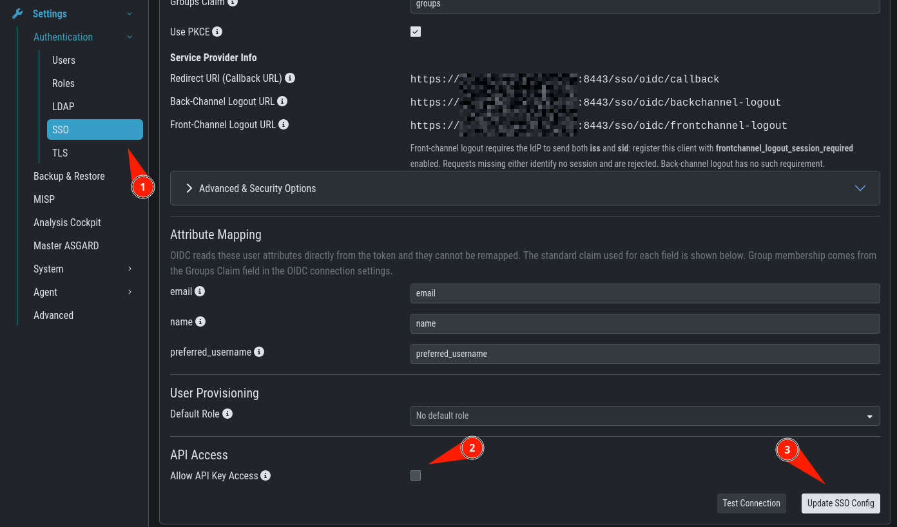

.. Index:: Single Sign-On

Single Sign-On
==============

The Management Center can delegate authentication to an external
identity provider (IdP), so that users log in with the account they
already use elsewhere in your organization. Both ``OpenID Connect``
(OIDC) and ``SAML 2.0`` are supported. Only one identity provider can
be active at a time.

Once Single Sign-On is configured, the login page shows an additional
``Login with SSO`` button. Local accounts and LDAP accounts remain
usable, so administrators can still log in if the identity provider is
unavailable.

   Login with SSO

Configuration
^^^^^^^^^^^^^

To configure Single Sign-On, navigate to ``Settings`` > ``Authentication`` >
``SSO``. Two ways to set up a connection are offered:

- **Guided mode** walks you through the configuration in five steps and
  is the recommended way to set up a new identity provider.
- **Advanced mode** presents all settings on a single page. Use it to
  review or change an existing configuration, or if your identity
  provider requires options that the guided setup does not cover.

Both modes write the same configuration, and you can switch between
them at any time.

   Guided and Advanced Mode Setup

.. note::
   Secrets such as the client secret, the service provider signing key
   and the token decryption keys are write-only. They are never
   returned by the Management Center and therefore appear empty after
   saving. Leave such a field empty to keep the stored value, or enter
   a new value to replace it.

Every change to the Single Sign-On configuration is written to the
audit log, together with the outcome of each login and logout.

Guided Mode
~~~~~~~~~~~

The guided setup asks for the required information one step at a time
and validates your input before it continues to the next step. You can
go back to an earlier step at any time. The configuration is not
applied until the last step is completed, so an existing Single
Sign-On configuration keeps working while you go through the wizard.

1. **Choose protocol** – select whether your identity provider uses
   ``OpenID Connect`` or ``SAML 2.0``.
2. **Register with your IdP** – the wizard shows the redirect URI of
   this Management Center. Register it with your identity provider,
   which in turn provides the client ID and the client secret you need
   in the next step. A disabled draft configuration is saved at this
   point so that the displayed URLs stay stable while you set up the
   identity provider, see :ref:`administration/sso:openid connect` and
   :ref:`administration/sso:saml 2.0`.
3. **Client credentials** – enter the details obtained from your
   identity provider: the issuer URL, the client ID and the client
   secret, as well as the requested scopes and the claim that carries
   the user's groups. The ``Use PKCE`` checkbox controls whether the
   authorization code flow is protected with Proof Key for Code
   Exchange.
4. **User access** – define what a user provisioned through this
   identity provider receives: the source of their group memberships,
   the role they are assigned if no group mapping matches, and whether
   they may use API keys. See :ref:`administration/sso:role mapping`
   and :ref:`administration/sso:api keys for sso users`.
5. **Test & enable** – validate the connection and enable Single
   Sign-On. A configuration can only be enabled if it passes
   validation.

   Guided Mode SSO Setup

.. note::
   The test login is performed with the settings entered in the
   wizard, not with the stored configuration. We recommend completing
   the test successfully before saving, and keeping a local
   administrator account available in case the identity provider
   becomes unavailable later.

Settings that the guided setup does not ask for keep their default
values and can be adjusted afterwards in the advanced mode.

Advanced Mode
~~~~~~~~~~~~~

The advanced mode shows the complete configuration on one page,
grouped by topic. In addition to the settings of the guided setup, it
holds the options that are only needed for specific identity
providers, such as the ``JWE`` settings for OpenID Connect and the
signature requirements for SAML.

The ``Allow API Key Access`` option at the bottom of the page is the
same setting as in step 4 of the guided setup, see
:ref:`administration/sso:api keys for sso users`.

Changes take effect once you save the configuration. The test function
is available here as well and uses the values currently entered in the
form, so you can verify a change without saving it first.

OpenID Connect
~~~~~~~~~~~~~~

For OpenID Connect you need the issuer URL of your identity provider,
a client ID and a client secret. Register the Management Center as a
confidential client at your identity provider and allow the redirect
URI shown in the configuration page.

You can adjust the requested scopes and the claim that carries the
user's group memberships. ``Use PKCE`` enables Proof Key for Code
Exchange and can be cleared for identity providers that do not support
it. If your provider issues encrypted (``JWE``) tokens, configure the
corresponding decryption key and algorithms.

   Advanced Mode SSO Setup - OIDC

SAML 2.0
~~~~~~~~

For SAML 2.0, the identity provider metadata can be supplied as a URL,
which is refreshed automatically, as pasted XML, or entered manually.
The Management Center generates its own service provider keypair and
publishes the service provider metadata at a dedicated endpoint, which
you can hand to your identity provider.

The ``NameID`` format, the attributes mapped to the user account and
the ``ForceAuthn`` flag can be adjusted to match your identity
provider. Both service-provider-initiated login and
identity-provider-initiated login through the Assertion Consumer
Service are supported.

   Advanced Mode SSO Setup - SAML

.. note::
   Assertions must be signed. Some identity providers sign only the
   enclosing response, for example Keycloak with ``Sign Documents``
   enabled but ``Sign Assertions`` disabled. For these providers the
   requirement can be relaxed in the configuration. We recommend
   enabling assertion signing at the identity provider instead.

Role Mapping
^^^^^^^^^^^^

Groups reported by the identity provider are mapped to Management
Center roles in the same way as LDAP groups
(see :ref:`administration/users:ldap configuration`). A user can
receive several roles if several of their groups are mapped.

Optionally, a default role can be defined for users whose groups match
none of the mappings. If no default role is configured, such users are
rejected. Roles are resolved again on every login, so a change at the
identity provider takes effect the next time the user logs in.

   SSO Roles Mapping

SSO Users
^^^^^^^^^

Users who log in through Single Sign-On are created in the Management
Center on their first login and appear in the user list like any other
account. Their accounts are managed by the identity provider and
therefore read-only. The only field an administrator can change is the
``Disabled`` toggle, which blocks the account locally.

   SSO Users

Two-factor authentication is not offered for these users, because the
second factor is handled by the identity provider.

API Keys for SSO Users
~~~~~~~~~~~~~~~~~~~~~~

Users provisioned through Single Sign-On cannot create an API key
unless this is explicitly allowed. The corresponding option,
``Allow API Key Access``, is offered in step 4 of the guided setup and
at the bottom of the advanced configuration. It is disabled by
default. While it is disabled, an attempt to create a key is refused
with a message explaining why.

Once the option is enabled, Single Sign-On users generate an API key in
their user settings like any other user
(see :ref:`administration/user-settings:api key`).

   API Key Access for SSO Users

.. warning::
   An API key of an SSO user carries the permissions its owner had at
   their last interactive login. These permissions are not refreshed
   when the key is used, so a group change or a deprovisioning at the
   identity provider does not reach the key. Delete the key or disable
   the user in the Management Center to revoke it.

Logout
^^^^^^

Logging out of the Management Center ends the local session only. The
session at the identity provider remains open, which means that the
next login can be answered without asking for credentials again. For
SAML, enabling ``ForceAuthn`` makes the identity provider
re-authenticate the user on every login.

The Management Center also accepts logout messages from the identity
provider, so that a logout performed there ends the corresponding
Management Center sessions. Logout messages that cannot be validated
or matched to a session are rejected and recorded in the audit log;
the affected session stays active in this case.
