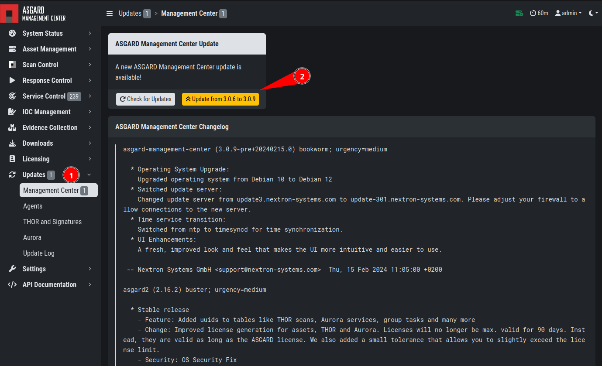
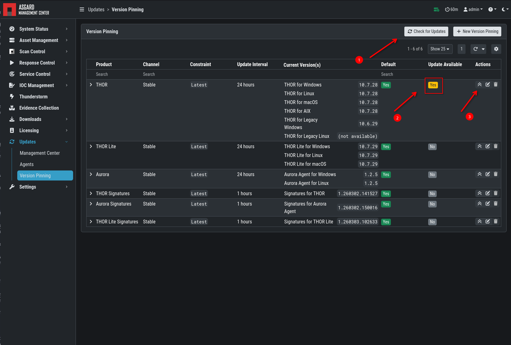
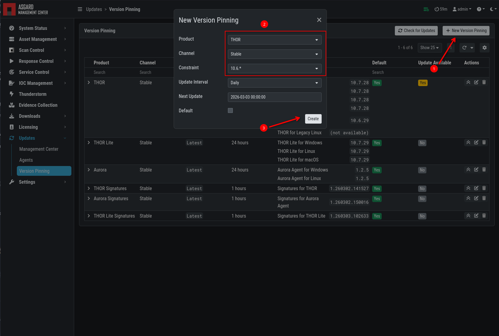

.. index:: Updates

Updates
=======

ASGARD Updates
^^^^^^^^^^^^^^

ASGARD checks for ASGARD updates daily. Available
updates are shown automatically in the ``Updates`` section.

As soon as an ASGARD update is available, the ``Upgrade from ... to ...``
button appears. Click this button to start the update process. The
ASGARD service restarts and the user must log in again. In general, update
Master ASGARD before connected ASGARD systems.

   Updating ASGARD

Version Pinning
^^^^^^^^^^^^^^^

The ``Version Pinning`` section allows you to create constraints
to "pin" a specific version of THOR, Aurora, or any signatures.
This allows you to stay on specific major or minor versions
of our products.

By default, ASGARD will search for signature updates every hour
and for THOR/Aurora updates every day. You can change the update
interval if needed, though the default values are usually sufficient
for most cases.

To manually check whether a new update is available, click
``Check for Updates``. This does not download new versions. It only checks
whether new versions are available according to your pinning constraints.

If new updates are available, you can manually download them via the
``Update Products Now`` button.

   Version Pinning

Setting a new version pinning configuration is straightforward:

- Select your Product
- Select the Channel
- Select a Constraint

   Version Constraint

Agent Updates
^^^^^^^^^^^^^

If an asset or an agent can be updated, a notice is
shown in the ``Updates`` > ``Agents`` tab.

.. figure:: ../images/mc_agent-update.png
   :alt: Update Agent

   Update Agent
