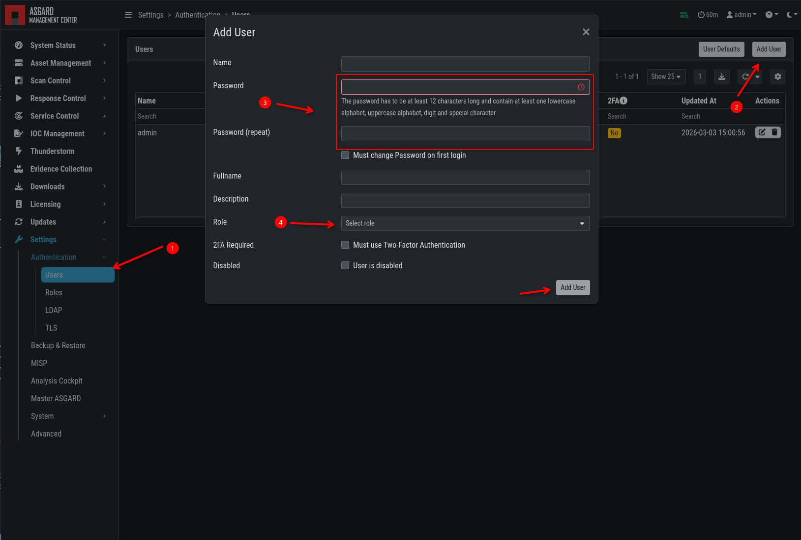
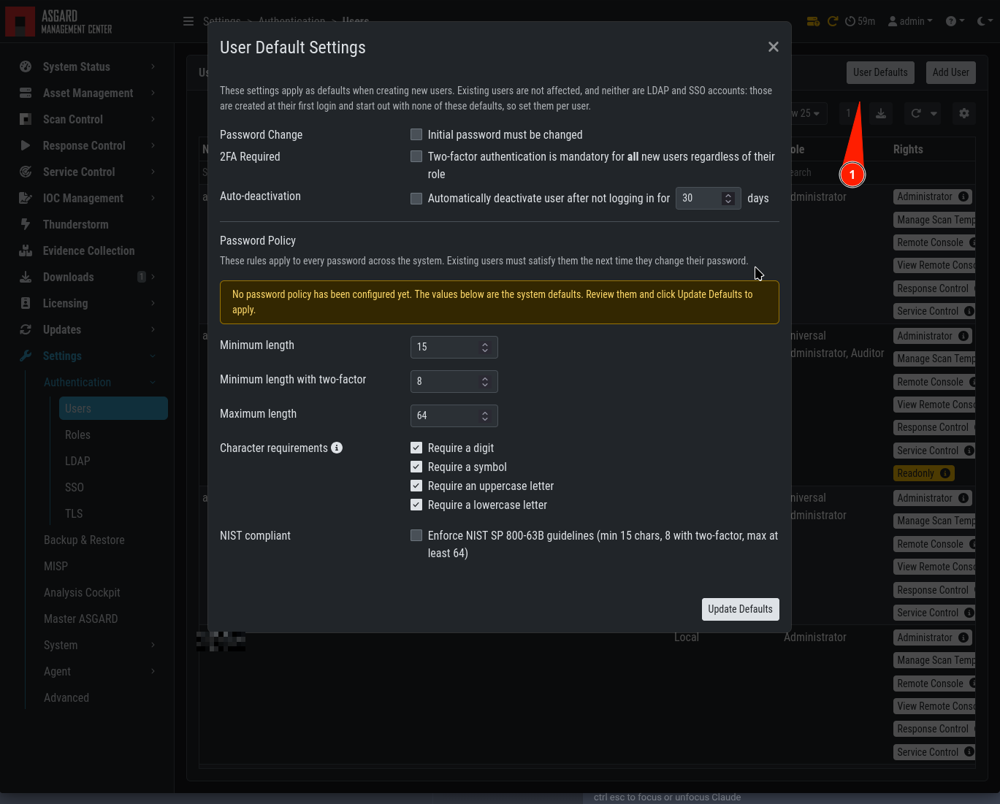

.. index:: User Management

User Management
===============

Access user management via ``Settings`` > ``Users``. This section
allows administrators to add or edit user accounts.

The ``2FA`` field in the overview indicates whether a
user has ``Two Factor Authentication`` enabled.

When creating a user, you can enforce a password change
and the use of 2FA. If those options are selected, the
user can only use the Management Center with limited
functionality until the password has been changed and
2FA has been enabled.

   Add User Account

Editing a user account does not require a password, even though the fields
are shown in the dialog. An initial password is required for user creation.

Access the user roles in ``Settings`` > ``Roles``.

You can download a list of all users in CSV format.

The overview lists local accounts as well as accounts provisioned
through LDAP and Single Sign-On. The ``Type`` field indicates the
origin of an account:

.. list-table::
   :header-rows: 1
   :widths: 30, 70

   * - Type
     - Description
   * - Local
     - Account created and managed in the Management Center
   * - LDAP
     - Account provisioned from the directory
       (see :ref:`administration/users:ldap configuration`)
   * - SSO
     - Account provisioned by the identity provider
       (see :ref:`administration/sso:single sign-on`)

Regardless of their origin, all accounts carry roles, permissions and
preferences in the same way. Fields that are managed outside the
Management Center cannot be edited here: the password and role fields
are hidden for LDAP users, and SSO users are read-only except for the
``Disabled`` toggle.

User Defaults
^^^^^^^^^^^^^

You can set user defaults to preselect certain options when
a new user is created. These are not strict enforcements. They
set the default values when the User Creation modal is opened.

The dialog also holds the password policy and the automatic
deactivation of inactive users. In contrast to the preselected
options, these two settings are enforced.

   User Defaults

Password Policy
~~~~~~~~~~~~~~~

The password policy applies to local accounts and is enforced whenever
a password is set or changed. Passwords of LDAP and Single Sign-On
users are governed by the directory or the identity provider.

.. list-table::
   :header-rows: 1
   :widths: 30, 70

   * - Setting
     - Description
   * - Minimum Length
     - Shortest accepted password. The default is 15 characters, in
       line with NIST SP 800-63B
   * - Minimum Length with 2FA
     - Separate, typically lower minimum for users who have
       two-factor authentication enabled
   * - Maximum Length
     - Longest accepted password
   * - Character Classes
     - Require a digit, a symbol, an upper case or a lower case
       character
   * - NIST SP 800-63B Mode
     - Enforces the recommendations of NIST SP 800-63B - This will flag
       any of the above settings if they are not adhering to the NIST SP
       800-63B standard

.. note::
   The policy is applied the next time a password is changed. Existing
   passwords remain valid until then. To apply a new policy
   immediately, enforce a password change for the affected users.

Automatic Deactivation
~~~~~~~~~~~~~~~~~~~~~~

Local users can be deactivated automatically after a configurable
number of days without a login. The value set in the user defaults
applies to newly created users and can be adjusted for each user
individually. A deactivated user can be enabled again by an
administrator.

LDAP and Single Sign-On accounts are governed by the directory or the
identity provider and are not deactivated this way.

Roles
^^^^^

By default, the Management Center ships with the following
pre-configured user roles. The pre-configured roles can be modified or
deleted. The role model is fully configurable.

.. figure:: ../images/mc_roles-factory-defaults.png
   :alt: User Roles

   User Roles – Factory Defaults

All users except users with the ``Readonly`` right can run scans on endpoints.

The following section describes the predefined rights and restrictions that
each role can have.

Rights
^^^^^^

.. list-table::
   :header-rows: 1
   :widths: 30, 70

   * - Role
     - Permissions
   * - Administrator
     - Unrestricted
   * - Manage Scan Templates
     - Allows scan template management
   * - Remote Console
     - Connect to endpoints via remote console
   * - View Remote Console Log
     - Review the recordings of all remote console sessions
   * - Response Control
     - Run playbooks, including playbooks for evidence collection, to kill processes or isolate an endpoint
   * - Service Control
     - User can manage services on endpoints, e.g. Aurora

Restrictions
^^^^^^^^^^^^

.. list-table::
   :header-rows: 1
   :widths: 30, 70

   * - Role
     - Restrictions
   * - Force Scan Template [2]_
     - Force user to use predefined scan templates that are not restricted
   * - No Inactive Assets [2]_
     - Cannot view inactive assets in asset management.
   * - No Task Start [2]_
     - Cannot start scans or tasks (playbooks)
   * - Readonly [2]_
     - Cannot change anything or run scans or response tasks. Used to generate read-only API keys

.. [2] Restricted roles have a yellow font in the UI.

LDAP Configuration
^^^^^^^^^^^^^^^^^^

To configure LDAP, navigate to ``Settings`` > ``LDAP``.
In the left column you can test and configure the LDAP connection itself.
In the right column, the mapping of LDAP groups to Management Center
groups (and its associated permissions) is defined.

First, check whether your LDAP server is reachable by the Management
Center by clicking "Test Connection".

.. note::
   If you are using LDAPS with a self-signed certificate or a custom CA,
   you must trust the signer on the Management Center.
   Copy the CA certificate to ``/usr/local/share/ca-certificates``.
   Run ``sudo update-ca-certificates``.
   Restart the Management Center service:
   ``sudo systemctl restart asgard-management-center``.

.. figure:: ../images/mc_ldap-server.png
   :alt: Configure the LDAP Server

   Configure the LDAP Server

Then check the bind user you want to use for the Management Center. Read
permissions on the bind user are sufficient. To find out
the distinguished name, use an LDAP browser or query it
using the PowerShell AD module command ``Get-ADUser <username>``.

.. figure:: ../images/mc_ldap-bind.png
   :alt: Configure the LDAP Bind User

   Configure the LDAP Bind User

Next, configure the LDAP filters used to identify the groups and
users and their preferred attributes in your LDAP structure.
A default for LDAP and AD in a flat structure is given in the
**"Use recommended filters"** drop-down menu, but you can
adapt it to your environment. The test button shows whether a login
with that user would be successful and which groups the Management
Center identified and could be used for a mapping to Management Center
groups.

.. figure:: ../images/mc_ldap-filter.png
   :alt: Configure the LDAP User and Group Filters

   Configure the LDAP User and Group Filters

If you need to adapt the recommended configuration or want to customize it,
we recommend an LDAP browser such as `ADExplorer <https://docs.microsoft.com/en-us/sysinternals/downloads/adexplorer>`_
from Sysinternals to browse your LDAP structure. For example, you could
use your organization's email address as a user login name if you change the "User Filter"
to ``(&(objectClass=user)(objectCategory=user)(userPrincipalName=%s))``

.. note::
   You need to save the configuration by clicking ``Update LDAP Config``.
   Using the test buttons only uses the data in the forms, but does not
   save it. You can use the test buttons for testing at any time
   without changing your working configuration.

After the LDAP configuration is set up, provide role mappings from LDAP
groups to Management Center groups. This is done in the right column with the
``Add LDAP Role`` feature.

.. figure:: ../images/mc_ldap-roles.png
   :alt: LDAP Group to Role Mapping

   LDAP Group to Role Mapping
