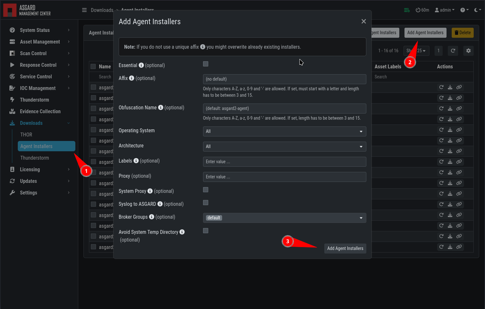

.. index:: Creating Custom Agent Installer

Creating Custom Agent Installers
================================

ASGARD supports custom agent installers. You can configure custom installers
so agents appear with a preset label or use a preset proxy configuration.

Go to ``Downloads`` > ``Agent Installers`` > ``Add Agent Installer``.
Edit the properties of the desired installer and generate the installer
by clicking ``Add Agent Installers``. The installers are available at the
downloads page next to the default installers. Use a unique prefix or suffix
to make each custom installer easy to identify.

   Custom Agent Installer from the WebUI

.. note::
   If a new version of the agent installer is available, ASGARD shows a notice
   that agent installers need repacking. Click ``Repack Outdated Agent
   Installers`` and wait for the process to finish. This ensures that newly
   downloaded installers use the newest version.
