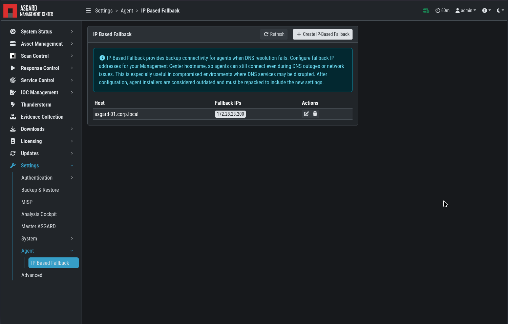

.. index:: IP Based Fallback

IP Based Fallback
=================

IP-Based Fallback provides backup connectivity for agents when DNS
resolution fails. You can configure fallback IP addresses for your
Management Center hostname so agents can still connect even during DNS
outages or network issues. This is especially useful in incident response
scenarios or compromised environments where DNS services may be disrupted.

Go to ``Settings`` > ``IP-Based Fallback`` and add one or more fallback IP
addresses for your Management Center FQDN.

   IP Based Fallback

.. note::
   Endpoints must run agent version **1.7.0** or newer. Older versions do not
   support IP-Based Fallback.

.. note::
   Fallback IP addresses must be configured **before** rolling out your
   agents. The setting is applied at installation time and cannot easily be
   changed on agents that are already deployed.

.. note::
   After changing the fallback configuration, existing agent installers are
   marked as outdated. Click ``Repack Outdated Agent Installers`` and wait
   for the process to finish so that newly downloaded installers include the
   new settings. The fallback settings are baked into the installer.
