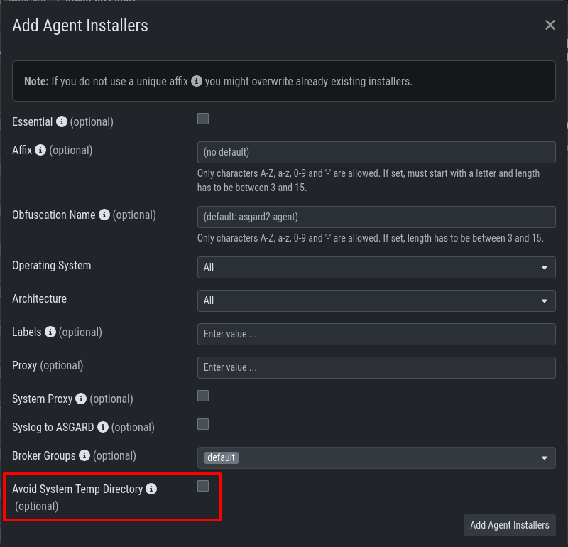

.. index:: Avoid System Temp Directory

Avoid System Temp Directory
===========================

By default, the Agent stores the THOR package, including signatures and license,
in the OS system directory during the scan:

.. list-table:: 
  :header-rows: 1
  :stub-columns: 1

  * - OS
    - Path
  * - **Windows**
    - %SYSTEMROOT%\\Temp\\asgard2-agent\\
  * - 
    -
  * - **Linux**
    - /var/tmp/asgard2-agent/
  * - 
    -
  * - **macOS**
    - /var/tmp/asgard2-agent/

If these paths are restricted (for example, by ``CIS Benchmark settings``), 
enable the following path by checking the box in the Agent Installer settings:

.. list-table:: 
  :header-rows: 1
  :stub-columns: 1

  * - OS
    - Path
  * - **Windows**
    - %SYSTEMROOT%\\System32\\asgard2-agent\\jobs\\
  * -   
    -
  * - **Linux**
    - /var/lib/asgard2-agent/jobs/
  * - 
    -
  * - **macOS**
    - /private/var/lib/asgard2-agent/jobs/

Go to ``Downloads`` > ``Agent Installers`` and add a new Agent Installer.

   Avoid System Temp Directory

.. note::
   Endpoints must run agent version **1.7.0** or newer. Older versions do not
   support Avoid System Temp Directory.

.. note::
   The alternative execution path for THOR must be configured **before** rolling out your
   agents. The setting is applied at installation time and cannot easily be
   changed on agents that are already deployed.
