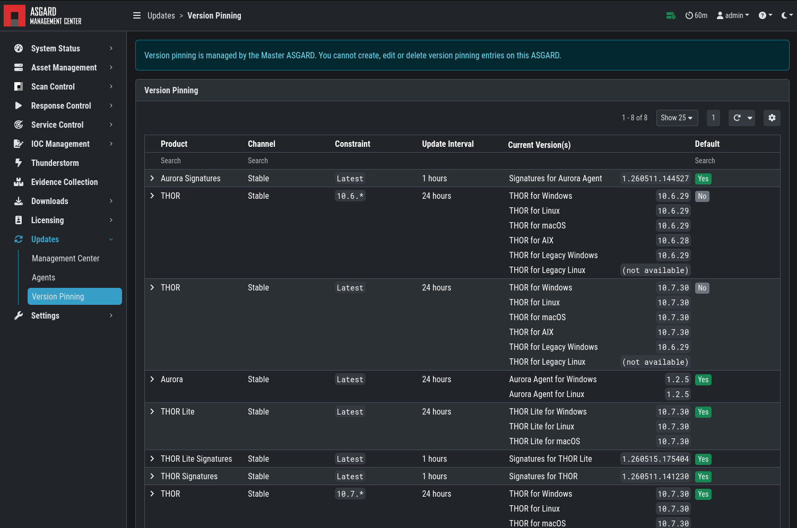

.. index:: Master Management Center

Installation
------------

The Master Management Center is a central management console for
controlling multiple Management Centers. It centrally manages scans
across your Management Centers and provides one central point for
Response Playbooks, Evidence Collection, and IOC Management. A
dedicated license is required.

To install the Master Management Center, use the Nextron Universal
Installer. Follow the instructions in the following chapter:
:ref:`setup/components:install the management center service`.

Hardware Requirements for Master Management Center
--------------------------------------------------

The Master Management Center has the following hardware requirements:

.. list-table::
   :header-rows: 1
   :widths: 50, 50

   * - Component
     - Value
   * - System Memory
     - 16 GB
   * - Hard Disk
     - 1 TB
   * - CPU Cores
     - 8

License Management
------------------

Once you connect your Management Centers to a Master Management Center,
the licensing sections on connected Management Centers become inactive.
The local license will be replaced with the Master Management Center
license. Every Management Center can issue scanning licenses to assets
as long as the total number of scanned servers and workstations does
not exceed the number of systems in the Master license.

Setting up Master Management Center
-----------------------------------

The setup procedure for the Master Management Center is identical to
the setup procedure for the Management Center; see
:ref:`setup/index:setup guide`. The only difference is that you need to
provide a Master Management Center license file.

Link Management Centers with Master Management Center
-----------------------------------------------------

On your Management Center, go to ``Settings`` >
``Master Management Center``, generate a one-time code and copy it.

.. figure:: ../images/mc_master-link-code.png
   :alt: Generate One Time Token

   Generate One Time Token on the Management Center

In the Master Management Center go to ``Connected Management Centers``,
click the ``Add Management Center`` button in the upper-right corner,
and use the hostname and one-time token to connect that Management
Center. You can use a description to provide more information about that
Management Center, e.g. ``DMZ 1`` or ``Region EMEA - HQ 1``.

.. figure:: ../images/mc_master-add-mgmt.png
   :alt: Link a Management Center in the Master Management Center

   Link a Management Center in the Master Management Center

.. note::
   You do not have to provide a port in the hostname field. Do not use a
   URL like ``https://``, just the FQDN. Remember that the Master
   Management Center must be able to reach v2 systems on port 5443/tcp
   and v1 systems on port 9443/tcp. Also make sure that the Master
   Management Center system is able to resolve the FQDN of the
   Management Center.

Scan Control
------------

Scan Control in the Master Management Center looks the same as in a
Management Center. The only difference is that you can select a
Management Center or "All Management Centers" to run the scans on.

.. figure:: ../images/mc_master-scan-control.png
   :alt: Master Management Center Scan Control

   Scan Control in the Master Management Center - Add Group Task

Asset Management
----------------

Asset Management in the Master Management Center is very similar to
Asset Management in a Management Center.

The only differences are:

* The ``Management Center`` column shows to which Management Center the
  endpoint is connected
* Only CSV export is allowed (asset labeling via CSV import is unavailable)

IOC Management
--------------

On the Master Management Center you can manage IOCs exactly like on a
Management Center. The only limitation is that IOCs in the Master
Management Center and in a Management Center are isolated. That means
if you want to use the IOCs from the Master Management Center, you need
to initiate the scan from the Master Management Center, and if you want
to use the IOCs from a Management Center, you need to initiate the scan
from that Management Center. In general, we recommend managing IOCs in
the Master Management Center for maximum flexibility.

Service Control
---------------

Service Control lists assets with an installed service controller.
An asset is either managed by the Master Management Center or by its
connected Management Center, not by both. If an asset is managed by the
Master Management Center it can still be viewed by the connected
Management Center, and vice versa. If the Master Management Center or
the Management Center edits an asset configuration, it takes over
management of that asset regardless of which system managed it before.

Evidence Collection
-------------------

All collected evidence is available in the Master Management Center's
``Evidence Collection`` section.

Download Section
----------------

The ``Downloads`` section of the Master Management Center allows you to
generate and download Agent Installers on all connected Management
Centers. This allows
central management of the installers.

.. figure:: ../images/mc_master-download-section.png
   :alt: Example: Download Section in a Management Center but managed by the Master Management Center

   Example: Download Section in a Management Center but managed by the
   Master Management Center

Updates
-------

The ``Updates`` section contains a tab in which upgrades for the
Management Center can be installed.

The ``Version Pinning`` menu allows you to configure
version constraints for THOR, Aurora, and their respective signatures.
When a Master Management Center is in use, it takes over the role of
fetching and
distributing updates to the connected Management Centers, so the version
pinnings configured on the Master apply to all connected Management Centers.

This view is identical to a standalone Management Center
installation (see :ref:`administration/updates:version pinning`).

The view in your connected Management Centers, however,
will be different:

   Version Pinning view in a Management Center connected to a Master
   Management Center

Version pinnings are configured on the Master Management Center and are
propagated
to every connected Management Center. It is not possible to set a
different version for an individual connected Management Center —
all connected Management Centers use the same pinning configuration
defined on the Master.

User Management
---------------

The Master Management Center does not provide central user and role
management for all connected Management Centers. Since both the Master
Management Center and the Management Center can use LDAP for
authentication, complex and centralized user management should be based
on LDAP.

Master Management Center and Analysis Cockpit
---------------------------------------------

It is not possible to link a Master Management Center with an Analysis
Cockpit and transmit all scan logs via the Master Management Center to
a single Analysis Cockpit instance. Each Management Center must deliver
its logs separately to a connected Analysis Cockpit.

Master Management Center API
----------------------------

The Master Management Center API is documented in the
``API Documentation`` section and resembles the API in Management
Centers.

However, many API endpoints contain a field in which users select the
corresponding Management Center (via ``ID``) or all Management Centers
(``ID=0``).

.. figure:: ../images/master-api1.png
   :alt: Master Management Center API Peculiarity

   Master Management Center API Peculiarity
