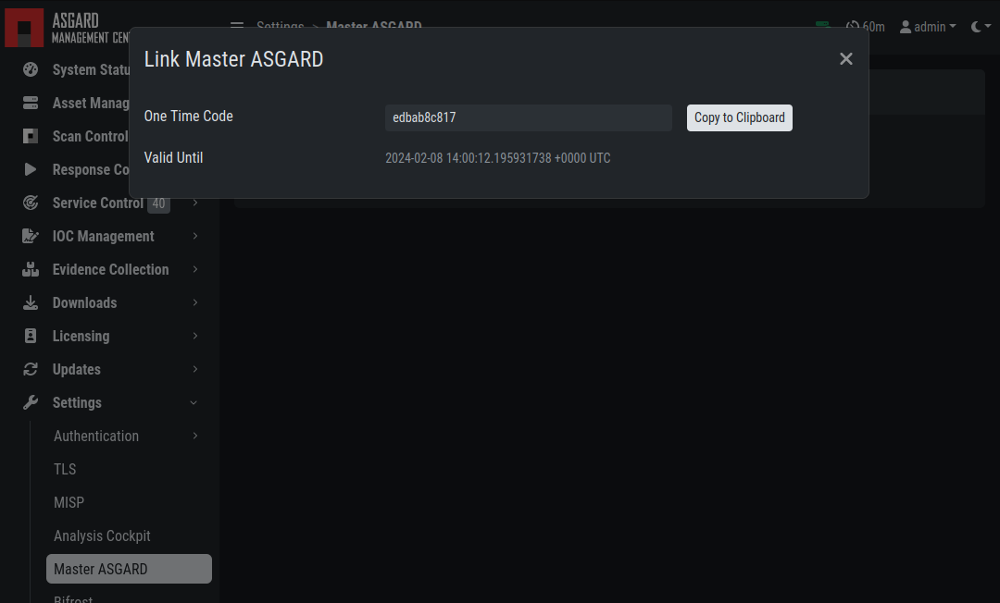
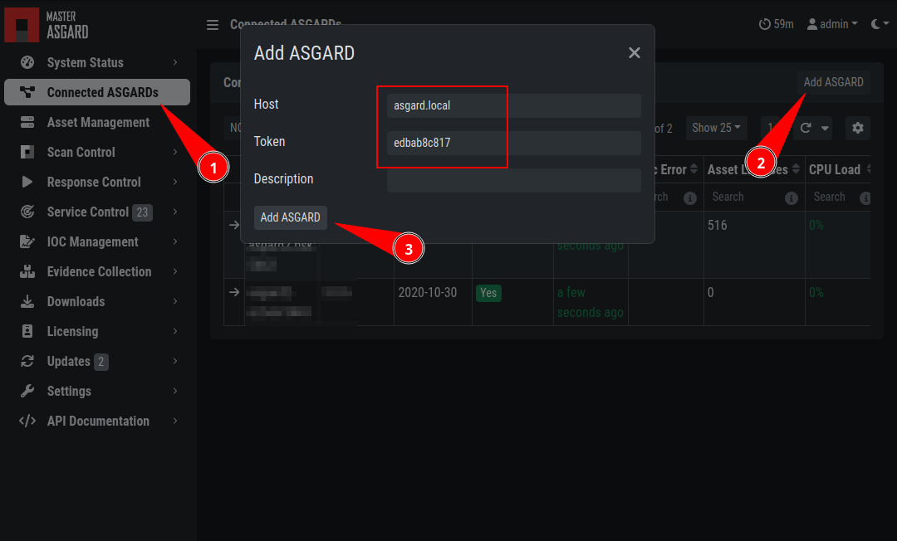

.. index:: Master Management Center

Installation
------------

Master Management Center is a single central management console that can control
all of your Management Centers. It is meant to centrally manage controlled
scans on all your Management Centers. Master Management Center also provides one central
point of management for your Response Playbooks, Evidence Collection
and IOC Management. A special license for this is needed.

To install a Master Management Center, you can use our Nextron Universal Installer.
Please follow the instructions in the following chapter:
:ref:`setup/components:install the management center service`.

Hardware Requirements for Master Management Center
--------------------------------------------------

The Master Management Center has the following hardware requirements:

.. list-table::
   :header-rows: 1
   :widths: 50, 50

   * - Component
     - Value
   * - System Memory
     - 16 GB
   * - Hard Disk
     - 1 TB
   * - CPU Cores
     - 8

License Management
------------------

Once you connect your Management Centers to your Master Management Center,
the licensing sections on connected Management Centers become inactive.
The local license will be replaced with the Master Management Center
license. Every Management Center can issue scanning licenses to assets
as long as the total number of scanned servers and workstations does not
exceed the number of systems in the Master license.

Setting up Master Management Center
-----------------------------------

The setup procedure for the Master Management Center is identical to the
setup procedure for the Management Center, see
:ref:`setup/index:setup guide`. The only difference is that you need to
provide a Master Management Center license file.

Link Management Centers with Master Management Center
-----------------------------------------------------

On your Management Center, go to ``Settings`` >
``Master Management Center``, generate a one-time code and copy it.

   Generate One Time Token on the Management Center

In the Master Management Center go to ``Connected Management Centers``,
click the ``Add Management Center`` button in the upper right corner, and
use the hostname and one-time token to connect that Management Center.
You can use a description to provide more information on that Management
Center, e.g. ``DMZ 1`` or ``Region EMEA - HQ 1``.

   Link a Management Center in the Master Management Center

.. note::
   You don't have to provide a port in the hostname field. Don't use a
   URL like ``https://``, just the FQDN. Remember that the Master
   Management Center must be able to reach v2 systems on port 5443/tcp and
   v1 systems on port 9443/tcp. Also make sure that the Master Management
   Center system is able to resolve the FQDN of the Management Center.

Scan Control
------------

Scan Control in the Master Management Center looks the same as in a
Management Center. The only difference is that you can select a
Management Center or "All Management Centers" to run the scans on.

.. figure:: ../images/mc_master-scan-control.png
   :alt: Master Management Center Scan Control

   Scan Control in the Master Management Center - Add Group Task

Asset Management
----------------

Asset Management in the Master Management Center is very similar to the
asset management in a Management Center.

The only differences are:

* The ``Management Center`` column shows to which Management Center the
  endpoint is connected
* Only CSV export is allowed (asset labeling via CSV import is unavailable)

IOC Management
--------------

On the Master Management Center you can manage IOCs exactly like on a
Management Center. The only limitation is that IOCs in the Master
Management Center and in a Management Center are isolated. That means if
you want to use the IOCs from the Master Management Center, you need to
initiate the scan from the Master Management Center, and if you want to
use the IOCs from a Management Center, you need to initiate the scan from
that Management Center. In general we suggest to manage IOCs in the
Master Management Center for maximum flexibility.

Service Control
---------------

Service Control lists the asset with an installed service controller.
An asset is either managed by the Master Management Center or by its
connected Management Center, not by both. If an asset is managed by the
Master Management Center it can still be viewed by the connected
Management Center (and vice versa). If the Master Management Center or
the Management Center edits a configuration of an asset it will take over
the "leadership" over this asset, no matter by which it was managed
beforehand.

.. screenshot needed after fix
   .. figure:: ../images/mc_master-service-controller.png
      :alt: Example: Service Controller listed in a Management Center but managed by the Master Management Center

      Example: Service Controller listed in a Management Center but managed
      by the Master Management Center

Evidence Collection
-------------------

All collected evidence is available in Master Management Center's ``Evidence Collection`` section. 

Download Section
----------------

The ``Downloads`` section of Master Management Center allows to generate and
download Agent Installers on all your connected Management Centers. This
allows for a central management of the Installers.

.. figure:: ../images/mc_master-download-section.png
   :alt: Example: Download Section in a Management Center but managed by the Master Management Center

   Example: Download Section in a Management Center but managed by the
   Master Management Center

Updates
-------

The ``Updates`` section contains a tab in which upgrades for
the Management Center can be installed.

The menu ``THOR and Signatures`` gives you an overview of
the used scanner and signature versions on all connected Management Centers.

This view is identical to a standalone Management Center
installation (see :ref:`administration/updates:updates of thor and thor signatures`)

The view in your connected Management Centers however
will be different:

.. figure:: ../images/mc_master-mc-thor-sig.png
   :alt: THOR and Signatures Update view when connected to a Master Management Center

   THOR and Signatures Update view when connected to a Master Management
   Center

It is possible to set a certain THOR and Signatures version for each
connected Management Center. However, if automatic updates are configured, this
setting has only effect until a new version gets downloaded.

Customers use this feature in cases where they want to test a certain
THOR version before using it in production. In this use case the
Management Center that runs the test scans is set to automatic updates,
while the
Management Centers in production use versions that administrators set manually
after successful test runs. 

User Management
---------------

Master Management Center offers no central user and role management for all connected
Management Centers. Since both the Master Management Center and the
Management Center allow to use LDAP for
authentication, we believe that complex and centralized user management
should be based on LDAP.

Master Management Center and Analysis Cockpit
---------------------------------------------

It is not possible to link a Master Management Center with an Analysis Cockpit and
transmit all scan logs via Master Management Center to a single Analysis Cockpit
instance. Each Management Center has to deliver its logs separately to a connected
Analysis Cockpit.

Master Management Center API
----------------------------

The Master Management Center API is documented in the ``API Documentation``
section and resembles the API in Management Centers. 

However, many API endpoints contain a field in which users select the
corresponding Management Center (via ``ID``) or all Management Centers
(``ID=0``)

.. figure:: ../images/master-api1.png
   :alt: Master Management Center API Peculiarity

   Master Management Center API Peculiarity
