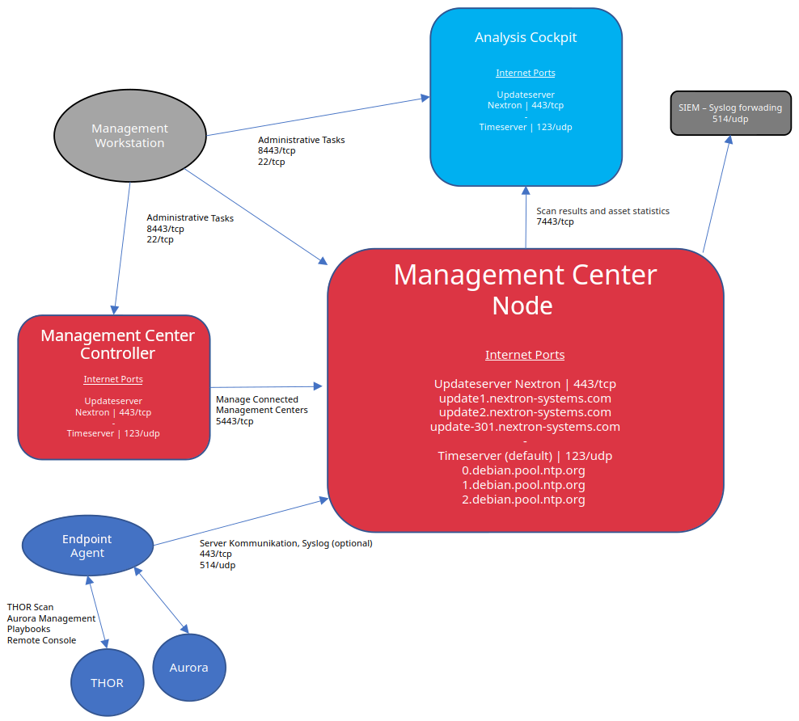

.. index:: Network Requirements

Network Requirements
--------------------

ASGARD and the systems that communicate with it require the following
ports to be open in the network. For a detailed and up-to-date list of
our update and licensing servers, see https://www.nextron-systems.com/hosts/.

.. important::

  The use of a web proxy that performs TLS/SSL interception is not supported.
  TLS interception will break both the agent-to-Management-Center
  connection and the connection to our update and licensing servers.
  Installing the intercepting proxy's CA on the ASGARD appliance does
  not work around this.

  Attempting this can result in errors like the one below:

  .. code-block:: none

    Certificate verification failed: The certificate is NOT trusted.
    The certificate issuer is unknown.
    Could not handshake: Error in the certificate verification.

From ASGARD Agent to ASGARD Server
^^^^^^^^^^^^^^^^^^^^^^^^^^^^^^^^^^

.. list-table:: 
   :header-rows: 1
   :widths: 60, 40

   * - Description
     - Ports
   * - Agent / Server communication
     - 443/tcp
   * - Syslog Forwarder (optional)
     - 514/udp [1]_
   * - ASGARD online check (optional)
     - ICMP

The syslog port is optional because agents can operate without it.
See :ref:`administration/syslog:syslog forwarding` for more information.

.. hint:: 
  ASGARD Agents check whether they can reach ASGARD via HTTPS.
  ICMP is not required, but it helps during troubleshooting.

From Management Workstation to ASGARD Server
^^^^^^^^^^^^^^^^^^^^^^^^^^^^^^^^^^^^^^^^^^^^

.. list-table:: 
   :header-rows: 1
   :widths: 60, 40

   * - Description
     - Ports
   * - Administrative web interface
     - 8443/tcp
   * - Command line administration
     - 22/tcp

From ASGARD to SIEM
^^^^^^^^^^^^^^^^^^^

.. list-table:: 
   :header-rows: 1
   :widths: 50, 50

   * - Description
     - Ports
   * - Syslog forwarder
     - 514/udp [1]_

From ASGARD to Analysis Cockpit
^^^^^^^^^^^^^^^^^^^^^^^^^^^^^^^

.. list-table:: 
   :header-rows: 1
   :widths: 70, 30

   * - Description
     - Ports
   * - Asset Synchronization, Log and Sample forwarding
     - 7443/tcp
   * - Syslog forwarder (optional)
     - 514/udp [1]_

From ASGARD and Master ASGARD to the Internet
^^^^^^^^^^^^^^^^^^^^^^^^^^^^^^^^^^^^^^^^^^^^^

The ASGARD systems are configured to retrieve updates from the
following remote systems via HTTPS on port 443/tcp:

.. list-table:: 
   :header-rows: 1
   :widths: 50, 50

   * - Product
     - Remote Systems
   * - ASGARD and system updates
     - update-301.nextron-systems.com
   * - THOR, Aurora, and Signature updates
     - update1.nextron-systems.com
   * - THOR, Aurora, and Signature updates
     - update2.nextron-systems.com

Configure all proxy systems to allow access to these URLs without TLS/SSL
interception. ASGARD uses client-side SSL certificates for authentication.
You can configure a proxy server, username, and password during the ASGARD
platform setup process. Only Basic authentication is supported. NTLM
authentication is not supported.

From Master ASGARD to ASGARD
^^^^^^^^^^^^^^^^^^^^^^^^^^^^

.. list-table:: 
   :header-rows: 1
   :widths: 60, 40

   * - Description
     - Port
   * - Management Backend
     - 5443/tcp

You cannot manage ASGARD v4 systems from a Master ASGARD v3 and vice versa.

From Management Workstation to Master ASGARD
^^^^^^^^^^^^^^^^^^^^^^^^^^^^^^^^^^^^^^^^^^^^

.. list-table:: 
   :header-rows: 1
   :widths: 70,30

   * - Description
     - Port
   * - Administrative web interface
     - 8443/tcp
   * - Command line administration
     - 22/tcp

Thunderstorm (optional)
^^^^^^^^^^^^^^^^^^^^^^^

Thunderstorm uses the following ports. This is optional and only required
if you plan to use Thunderstorm in ASGARD.

.. list-table:: 
   :header-rows: 1
   :widths: 50,50

   * - Description
     - Port
   * - HTTPS
     - 9443/tcp
   * - HTTP
     - 8080/tcp

See :ref:`administration/thunderstorm:Thunderstorm` for more information.

Secure Communication
^^^^^^^^^^^^^^^^^^^^

Connections within our products use TLS, except for syslog over plaintext.
Clients verify the server certificate used by ASGARD Management Center when
connecting. This helps prevent attackers from reading sensitive information
during a man-in-the-middle attack.

Time Synchronization
^^^^^^^^^^^^^^^^^^^^

ASGARD tries to reach the public Debian time servers by default.

.. list-table:: 
   :header-rows: 1
   :widths: 60, 40

   * - Server
     - Port
   * - 0.debian.pool.ntp.org
     - 123/udp
   * - 1.debian.pool.ntp.org
     - 123/udp
   * - 2.debian.pool.ntp.org
     - 123/udp

The NTP server configuration can be changed.

DNS
^^^

ASGARD needs to be able to resolve internal and external IP addresses.

.. warning:: 
  Make sure that you install ASGARD with a ``domain name``
  (see :ref:`setup/network:network configuration`). If you do not set the
  Domain Name before installing the ASGARD package, your clients will not
  be able to connect to ASGARD.

  All installed components should have a valid domain name configured to
  avoid issues later in the configuration.

Internet Access during Installation
^^^^^^^^^^^^^^^^^^^^^^^^^^^^^^^^^^^

The Nextron Universal Installer requires Internet access during setup.
The installation process fails if required packages cannot be loaded from
https://update-301.nextron-systems.com.

SSL/TLS Interception
~~~~~~~~~~~~~~~~~~~~

The installation and update processes do not accept an unknown but valid
SSL/TLS certificate presented by an intercepting entity and therefore do
not support SSL/TLS interception.

Because our products are often used in potentially compromised environments,
the integrity of our software and update packages has highest priority.

Architecture Overview
^^^^^^^^^^^^^^^^^^^^^

The following image shows an architecture overview with all products and
their communication relationships.

   Full Architecture

.. rubric:: Footnotes

.. [1] You can configure any port and protocol combination for this,
   e.g. 6514/tcp
