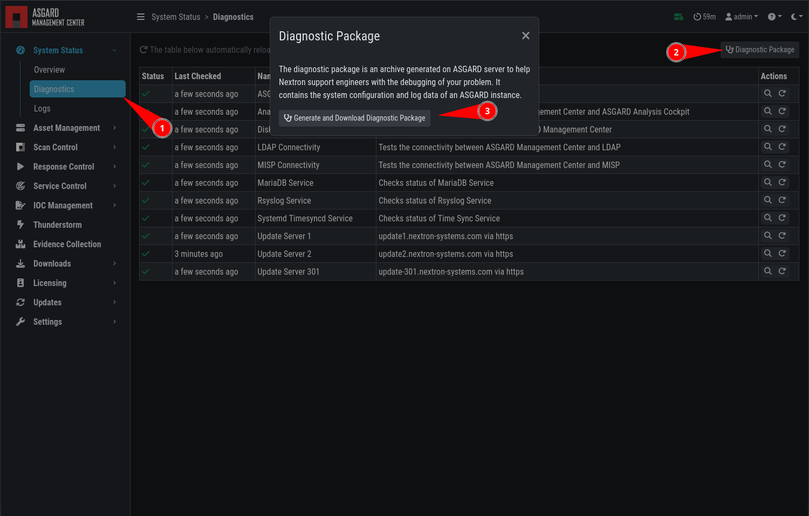

.. index:: Diagnostic Pack

Diagnostic Pack
===============

The diagnostic package is an archive generated on the Management Center to help
Nextron Support troubleshoot an issue. It contains the system configuration and
log data of a Management Center instance.

You can generate a Diagnostic Package in ``System Status`` > ``Logs`` >
``Diagnostics Package``.

The package can be too large to share by email. In this case, you can either:

1. ask Nextron Support for an upload link (secure file sharing), or
2. remove large log files from the package (e.g. the file ``/var/log/asgard-management-center/agent-access.log``
   is often responsible for 97% of the package size)
